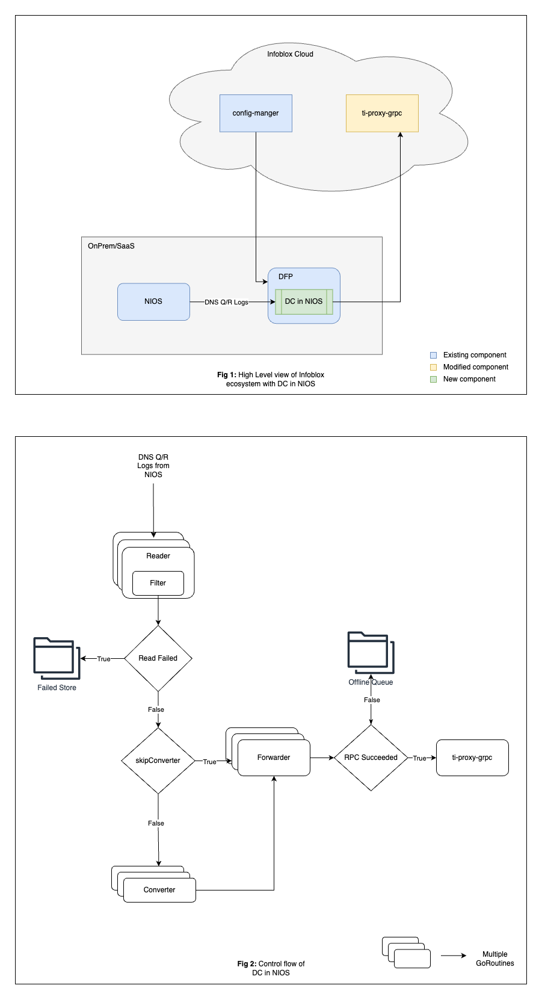

# Data Connector in NIOS (DCiN)

## Introduction
### Overview
The purpose of Data Connector in NIOS is to provide the customers with the ability to process data, without the need to use a separate machine for CDC. The DCiN will accept data from NIOS, process it as per the customer's configuration and send it to the cloud for further enrichment and analysis. This enables the customer to keep sensitive data within their network and only send the processed data to the cloud.

### Objectives
* To provide the customers with the ability to process data, without the need to use a separate machine for CDC.
* To provide an efficient and performant way to process and forward data to the cloud.
* To provide a highly available component that could be relied on for data processing without any significant lag and downtime.

## Architecture

## Components

### Reader
The reader component is responsible for reading the data from the passed directory and pass the data ahead in the pipeline. An inotify watcher is setup for the input directory. When a new file of supported type is created, the reader either passes the data to the filter, or converter for the conversion, or directly to the forwarder. The decision is based on the flags passed to the reader configuration.

In case the data is passed to the converter or forwarder, the data is passed on via buffered channels. In case of filter, the data is passed directly via a function call.

The source file will only be deleted if the reading of the file is successful. In case of any error, the file will be moved to a failed directory, and the error will be logged.

### Filter
As the name suggests, the this components will filter out data provided by the reader. Different filters based on the requirement can be plugged in as needed, as filter component is open to extension.

As the Reader component does not perform any resource intensive task by itself, the filter component is called directly from Reader, instead of passing it via a channel, and spawning the Filter process in a separate go routine.

TODO: What if filter fails?

### Converter
The converter component is responsible for the conversion of the file from one type to the another. The reader will pass the data to the converter if the file type is not supported by the ti-proxy-grpc or by the cloud component for which the message is destined.

TODO: What if converter fails?

### Forwarder
The forwarder component is responsible the processed data to ti-proxy-grpc. It takes care of authenticating using client certificate, and handling the RPC calls. In case the RPC call fails, the forwarder will save the processed files to a Offline Queue. The offline queue is maintained on the disk, and the processed files are stored under the directory with the same name as the destination type, this is done to ensure that the current configuration has no effect on the type of data being sent to the cloud, in case the destination configuration has been changed by the customer in between failures.

Upon failure, a separate go routine will be spawned to periodically check if the connection between NIOS and ti-proxy-grpc is restored (this can be acheived by TCP probing the ti-proxy-grpc server, equivalent to `nc -zv HOST PORT`). If the connection is restored, the forwarder will start sending the files from the Offline Queue.

## Observability

### Logging
All the logs will have timestamp, log level and the message. The logs will be written to a file, and the log file will be rotated based on the size of the log file. The log file will be rotated when the size of the log file reaches 10MB. The log file will be rotated to a new file, and the old log file will be compressed. The log file will be rotated to a maximum of 10 files.

#### Startup
The following information will be printed when the application starts:

* Number of goroutines
* Watch directory
* Enabled file types
* Enabled log types
* Enabled filters for each log type
* Enabled converters for each log type
* Forwarder endpoint

#### Component logs
Only the error logs will be logged for each component. This is done to reduce the amount of logs generated by the application and to not waste CPU cycles on logging.

### Metrics
The following metrics will be sent to prometheus

* Errors from the components
* Number of files processed per minute
* CPU/Memory utilization of the application (TODO: Should other performance metrics be included as well?)

## Configurations
The below are the configurable parameters:

* Number of go routines
* Log type
* Filters
* Skip Converter
* Forwarder type 

## Limitations

* The current implementation reads the data from the disk. This can be a bottleneck in case of high volume of data. A stream based approach can be implemented rather than reading the data from the disk.
* As DCiN will be a part of the DFP container, applying resource restriction on the DCiN will also restrict the resources available to the DFP container. This can be mitigated by running the DCiN as a separate container, but this will increase the complexity of the deployment.
